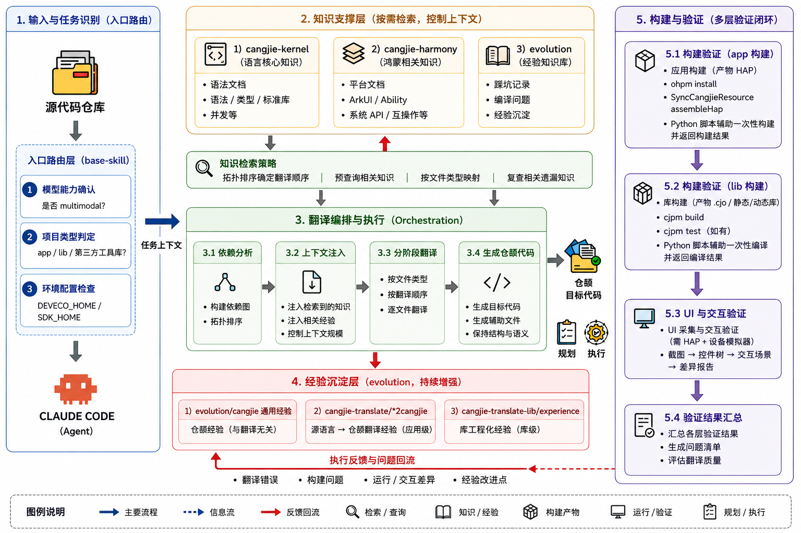

<div align="center">

# CangjieTransSkills



<p>
  <a href="LICENSE"></a>
  <a href=".claude/skills/"></a>
  <a href="CLAUDE.md"></a>
  <a href="CangjieProject/"></a>
</p>

<p><strong>面向仓颉语言 / HarmonyOS 代码迁移场景的 Claude Code Skills</strong></p>

<p>围绕 <strong>Claude Code + Skills</strong> 的翻译工作流，用于将应用项目或库项目翻译到仓颉，并将翻译过程中的经验持续回流到 Skills 与经验库中。</p>

</div>

## ✨ 项目简介

`CangjieTransSkills` 提供一套面向仓颉迁移场景的可复用工作流：

- 应用级翻译：ArkTS / Swift / Java / Python App → 仓颉 HarmonyOS 应用
- 库级翻译：任意语言库 / SDK / CLI → 纯仓颉 `cjpm` 包
- 配套支持：构建、测试、UI 检查、经验沉淀、文档下载
- 全程管理：操作型 Skill 自动使用 LoopX 管理 Goal、Todo、用户 Gate、恢复和结案
- 经验回流：将类型映射、API 替代、构建修复、语义差异与已知问题写回经验库，用于后续任务复用

核心 skill 位于 [`.claude/skills/`](.claude/skills/)，其中包含：

- `base-skill`：统一入口与路由
- `cangjie-loopx-management`：把所有操作型流程接入 LoopX 控制面
- `cangjie-translate`：应用级翻译
- `cangjie-translate-lib`：库级翻译
- `build` / `cangjie-lib-build`：应用与库的构建验证
- `harmonyos-ui-inspect`：UI 截图、控件树与交互验证
- `evolution`：翻译经验与踩坑记录，作为后续任务的经验底座

更完整的规则见 [CLAUDE.md](CLAUDE.md)。

## 📦 仓库内容

本仓库包含两部分内容：

1. **Skills 定义**
   用于指导 Claude Code 在仓颉 / HarmonyOS 场景下完成翻译、构建和验证。

2. **翻译样例项目**
   位于 [`CangjieProject/`](CangjieProject/)，用于展示这套 workflow 的实际产物。

## 🔁 经验回流与迭代

本仓库将翻译过程中的经验记录视为工作流的一部分，而不是附属产物。

- 每次翻译过程中遇到的非显而易见问题，均要求沉淀为经验
- 应用级经验写回 `cangjie-translate/` 对应语言目录
- 仓颉通用经验写回 `evolution/cangjie/`
- 库级工程化经验写回 `cangjie-translate-lib/experience/`

经验回流后，可直接用于后续同类任务，例如：

- 类型映射可以复用
- API 替代策略可以复用
- 构建与兼容性修复可以复用
- 已知限制和失败案例也会被记录下来，减少重复试错

因此，`CangjieTransSkills` 并非一组静态 prompt，而是一套可迭代维护的翻译与验证流程。

## 🚀 6 个翻译项目

以下 6 个项目均基于 **Skills + Claude Code + GLM5.1-FP8** 完成翻译或迁移，覆盖应用级与库级两类典型场景。

> 示例环境：macOS  
> 使用模型：GLM5.1-FP8 + Claude Code v2.1.112

### 📱 应用级项目

| 仓颉项目 | 原项目（GitHub） | 翻译方向 | 源语言 | 原始规模 | 简介 |
|------|------|------|------|------|------|
| [TimeScaleCangjie](CangjieProject/TimeScaleCangjie/) | [TimeScale](https://github.com/yingying1997/TimeScale) | ArkTS2Cangjie | ArkTS / ArkUI | 6073 行 | 面向 HarmonyOS 的重要日子、倒计时与纪念日管理应用，支持公历/农历日期、重复事件、系统日历提醒、桌面服务卡片和统计分析。 |
| [HarmonyOSNoteBookCangjie](CangjieProject/HarmonyOSNoteBookCangjie/) | [HarmonyOS-NoteBook](https://github.com/Magic181/HarmonyOS-NoteBook) | ArkTS2Cangjie | ArkTS / ArkUI | 1779 行 | “简账”智能记账本示例应用，围绕个人收支记录、消费统计、预算挑战和动态主题构建。 |
| [HabitCangjie](CangjieProject/HabitCangjie/) | [Habit](https://github.com/okmoz/Habit) | Swift2Cangjie | Swift / SwiftUI | 32 个文件，2334 行 | iOS 习惯追踪应用，支持习惯打卡、颜色分类、日历热力图、连续打卡记录以及日/周/月统计。 |

### 📚 库级项目

| 仓颉项目 | 原项目（GitHub） | 翻译方向 | 源语言 | 原始规模 | 简介 |
|------|------|------|------|------|------|
| [SplashCangjie](CangjieProject/SplashCangjie/) | [Splash](https://github.com/JohnSundell/Splash) | Swift2Cangjie | Swift | 50 个文件，5956 行 | 轻量、快速且灵活的 Swift 语法高亮工具，翻译后保留了核心库与多个 CLI 工具。 |
| [tinydbCangjie](CangjieProject/tinydbCangjie/) | [TinyDB](https://github.com/msiemens/tinydb) | Python2Cangjie | Python | 约 4500 行 | 轻量级纯 Python 文档数据库，使用 JSON 文件存储数据，提供类似 MongoDB 的查询 API 与中间件扩展机制。 |
| [mail-importerCangjie](CangjieProject/mail-importerCangjie/) | [mail-importer](https://github.com/google/mail-importer) | Java2Cangjie | Java | 约 4104 行 | 将 Thunderbird 本地邮件归档上传到 Gmail 的工具，支持保留附件、邮件头、已读/星标状态和文件夹结构。 |

## 🛠️ 使用方式

### 1. 安装 Claude Code

Claude Code 以 npm 包形式发布。本工作流同时使用 LoopX，统一要求 **Node.js 22.6+**：

```bash
# 全局安装
npm install -g @anthropic-ai/claude-code

# 验证安装
claude --version
```

### 2. 一键安装到目标项目

LoopX 是操作型 Skill 的内置管理依赖，要求 **Python 3.11+**，兼容版本范围为 **LoopX >=1.0.2,<2**。在 POSIX 系统中运行：

```bash
git clone https://github.com/cjhCoder7/CangjieTransSkills.git
cd CangjieTransSkills
./setup.sh /path/to/your-cangjie-project
```

`setup.sh` 会自动选择 Python 3.11+，随后完成：

- 安装或升级 LoopX，并执行 `loopx doctor --deep`；
- 安装 Claude Code 的 `/loopx` 命令入口；
- 安装或更新全部仓颉 Skill；
- 以托管区块方式合并 `CLAUDE.md` 和 `.gitignore`，保留用户已有内容；
- 生成 `.env.cangjie.example` 和安装清单；
- 回读校验 Skill 内容。更新已有文件前会备份到目标项目的 `.local/cangjie-trans-skills/setup-backups/`。

目标项目就是当前目录时可以省略路径。若需要指定解释器：

```bash
CANGJIE_SETUP_PYTHON=/path/to/python3.11 ./setup.sh /path/to/project
```

Windows PowerShell 可直接调用跨平台安装器：

```powershell
py -3.11 scripts\setup_loopx.py --install `
  --target-project C:\path\to\your-cangjie-project
```

LoopX 已由外部环境管理、只需安装项目 Skill 时运行：

```bash
./setup.sh --skip-loopx /path/to/your-cangjie-project
```

LoopX 的实现仍由其正式发行版维护；CangjieTransSkills 内置的是仓颉流程适配层，避免复制后出现协议和安全修复漂移。

安装后目标项目结构如下：

```
your-cangjie-project/
├── .claude/
│   └── skills/          # 全部 Skills 定义
│       ├── base-skill/
│       ├── cangjie-loopx-management/
│       ├── build/
│       ├── cangjie-kernel/
│       ├── cangjie-harmony/
│       ├── cangjie-translate/
│       ├── cangjie-translate-lib/
│       ├── cangjie-lib-build/
│       ├── harmonyos-ui-inspect/
│       ├── download-script/
│       └── evolution/
├── CLAUDE.md            # 原内容保留，并加入 CangjieTransSkills 托管区块
├── .env.cangjie.example # 环境配置模板
├── entry/               # HarmonyOS 应用目录（应用项目）
│   └── ...
└── cjpm.toml            # 或 cjpm 库项目
```

安装器会将运行时目录加入 `.gitignore`：

```gitignore
.env
.loopx/
.codex/goals/
.local/
ui_capture_output/
hm-docs/
*.log
```

### 3. 配置环境变量（.env）

在项目根目录创建 `.env` 文件，配置必要的环境变量：

```bash
# DevEco Studio 安装路径（/build 和 /harmonyos-ui-inspect 必需）
DEVECO_HOME=/Applications/DevEco-Studio.app/Contents

# 仓颉 SDK 路径（可选，不配置时自动检测 ~/.cangjie-sdk/）
CANGJIE_SDK_HOME=/Users/xxx/.cangjie-sdk/6.0/cangjie

# 按版本锁定 SDK（可选，优先级高于 CANGJIE_SDK_HOME）
CANGJIE_SDK_HOME-8k=/Users/xxx/.cangjie-sdk/6.0/cangjie
CANGJIE_SDK_HOME-15k=/Users/xxx/.cangjie-sdk/6.0/compatibility-sdk-xxx/compatibility
```

> **Windows 用户**：路径使用反斜杠（`C:\...`）或正斜杠（`C:/...`）均可。

### 4. 自定义模型

Claude Code 默认使用 Anthropic 官方模型，但支持通过环境变量切换为其他模型或第三方提供商。

如需使用第三方 API（如 OpenRouter、本地代理等兼容 Anthropic API 格式的服务）：

```bash
# 设置 API 地址和密钥
export ANTHROPIC_BASE_URL="https://api.your-provider.com/v1"
export ANTHROPIC_API_KEY="your-api-key"

# 设置使用的模型
export ANTHROPIC_MODEL="your-model-id"

# 启动 Claude Code
claude
```

> **注意**：本仓库中的 6 个样例项目均基于 **GLM5.1-FP8** 通过第三方 API 完成翻译。在 Claude Code 会话中运行 `/status` 可查看当前使用的模型和 API 端点。

### 5. 开始使用

在项目目录下启动 Claude Code：

```bash
cd /path/to/your-cangjie-project
claude
```

Claude Code 会自动加载 `CLAUDE.md` 和 `.claude/skills/` 中的 Skills。直接调用下列操作型 Skill 时，会自动创建或恢复 LoopX Goal，按 Todo/Gate/quota 管理工作，不需要先手工执行 `/loopx`：

```bash
# 应用级翻译
/cangjie-translate arkts /path/to/source-project

# 库级翻译
/cangjie-translate-lib /path/to/source-lib

# 编译构建（应用）
/build

# 编译构建（库）
/cangjie-lib-build

# UI 验证
/harmonyos-ui-inspect --auto-hap --emulator 5555
```

更完整的 skill 路由规则和前置检查流程见 [CLAUDE.md](CLAUDE.md)。

## 📄 License

[MIT](LICENSE)
